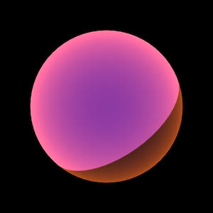

# [Unity/Shader Lab] Shader Journey

**Mina Pêcheux - Since September 2021**

This repository contains the code for my on-going series of articles on how to implement various VFX and rendering styles in Unity by writing your own shaders!

Shader assets are written using the [ShaderLab language](https://docs.unity3d.com/Manual/SL-Reference.html) and the [HLSL language](https://en.wikipedia.org/wiki/High-Level_Shading_Language).

Here is the list of all the articles:

- [Episode #0: Introduction](https://mina-pecheux.medium.com/shader-journey-0-introduction-78367f7b7252)
